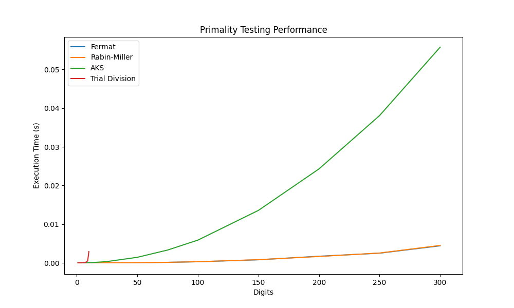

# Primality Testing Algorithms
This repository contains the implementation of four different primality testing algorithms:

* Fermat's Primality Test
* Miller-Rabin Primality Test
* Agrawal-Kayal-Saxena (AKS) Primality Test
* Trial Division

The repository includes a Python implementation of each algorithm, as well as a data generator for generating test numbers of varying sizes, and a test suite for evaluating the performance of each algorithm.

## Repository Structure
```zsh
├── README.md
├── code
│   ├── aks.py
│   ├── fermat.py
│   ├── miller_rabin.py
│   ├── primes.py
│   └── trial_division.py
├── docs
│   ├── Exploring the Efficiency and Accuracy of Primality Testing Techniques.pdf
│   └── primality-testing-performance.png
└── main.py
```

## Overview of Algorithms
### **Trial Division**
Trial Division is a deterministic primality test that assesses a number's primality by dividing it by all integers up to its square root. A number is prime if none of these integers divide it evenly, i.e., without leaving a remainder. For example, in determining whether 71 is prime, it is divided by integers up to $\sqrt{8} \approx (8.43)$. As none of these divisions yield a zero remainder, 71 is deemed prime.

### **Fermat's Primality Test**
Fermat's test, a probabilistic primality algorithm, utilizes Fermat's Little Theorem. The algorithm iterates $k$ times and randomly selects an integer $a$ between 2 and $p-1$ in each iteration. If for all iterations, the congruence $a^{p-1} \equiv 1 \pmod{p}$ holds, then $p$ is likely prime. Any violation of the congruence identifies $p$ as composite, with $a$ serving as Fermat's witness to compositeness.

### **Miller-Rabin Primality Test**
The Miller-Rabin test is a probabilistic primality algorithm with time complexity $O(k \hspace{0.25em} log^{3(n)})$, where $n$ is the candidate prime and $k$ the number of test iterations. Building upon Fermat's test and modulo congruences, it uses a system of congruences to establish "witnesses", values indicating compositeness. An odd prime lacks Miller-Rabin witnesses; thus, if $n$ possesses a witness, it's composite. This method is often favored, with 75% of numbers from 2 to $n-1$ acting as witnesses for odd composites.

### **Agrawal-Kayal-Saxena (AKS) Primality Test**
The AKS algorithm, a deterministic polynomial-time primality test, operates on the theorem stating that an integer $n > 2$ is prime if the polynomial congruence relation $(X + a)^ n = (X^n + a) \hspace{0.1cm} (mod \hspace{0.1cm} n)$ holds for some $a$ coprime to $n$.

The test first ensures $n \geq 1$, then checks if $n$ is a perfect power (thus non-prime). It then finds the smallest $r$ such that $n \bmod r$ exceeds the square root of $r$'s largest prime factor. After setting these bounds, the test examines $n$'s greatest common divisor and checks if the polynomial congruence holds for integers $1$ to $\sqrt{r}+1$.

If satisfied, $n$ is prime. Its time complexity is $O(log^6 n)$. While noted for theoretical importance as the first deterministic primality test, AKS isn't the most efficient, and probabilistic tests, like Miller-Rabin, can often prove superior.

## Performance Evaluation
This table presents the execution times (in seconds) of four different primality testing algorithms - Fermat's test, Miller-Rabin test, AKS test, and Trial Division–for numbers of varying digit lengths.

In general, as the digit length of the tested number increases, the execution time of all algorithms also increases. For smaller digit lengths (1 to 17 digits), all algorithms are feasible with relatively low execution times.

Fermat's test and Miller-Rabin test show similar time complexity, both exhibiting relatively consistent and manageable increases in execution time, even as the digit length increases to 300. These algorithms remain practical for large numbers.

The AKS test also shows a steady increase in time with an increase in digit length. However, its execution time rises more sharply than that of Fermat's and Miller-Rabin tests, especially for numbers with higher digit lengths, indicating it might not be as efficient for larger numbers.

Trial Division, on the other hand, becomes impractical for larger numbers. For numbers up to 17 digits, the execution time increases at a higher rate compared to the other algorithms. Beyond 18 digits, the execution time becomes infeasibly high (represented as 'inf'), suggesting that the algorithm can't effectively handle numbers of this magnitude.

In summary, for testing the primality of large numbers, Fermat's test and the Miller-Rabin test offer the most efficient performance, while the AKS test is less efficient and Trial Division is impractical.

Digits | Fermat | Miller-Rabin | AKS | Trial Division
:---- |:--- |:--- |:--- |:---
1 | 0.000009 | 0.000002 | 0.000007 | 0.000001
2 | 0.000002 | 0.000001 | 0.000010 | 0.000002
3 | 0.000002 | 0.000002 | 0.000009 | 0.000003
4 | 0.000003 | 0.000005 | 0.000014 | 0.000002
5 | 0.000003 | 0.000004 | 0.000017 | 0.000005
6 | 0.000003 | 0.000002 | 0.000027 | 0.000018
7 | 0.000002 | 0.000003 | 0.000031 | 0.000062
8 | 0.000002 | 0.000002 | 0.000039 | 0.000256
9 | 0.000002 | 0.000002 | 0.000045 | 0.000525
10 | 0.000007 | 0.000006 | 0.000064 | 0.002917
11 | 0.000011 | 0.000006 | 0.000077 | 0.004309
12 | 0.000007 | 0.000006 | 0.000082 | 0.017706
13 | 0.000006 | 0.000005 | 0.000092 | 0.076358
14 | 0.000015 | 0.000006 | 0.000129 | 0.141670
15 | 0.000009 | 0.000006 | 0.000133 | 0.845349
16 | 0.000019 | 0.000010 | 0.000167 | 1.764397
17 | 0.000030 | 0.000008 | 0.000202 | 4.824857
18 | 0.000040 | 0.000013 | 0.000217 | 20.101306
19 | 0.000034 | 0.000013 | 0.000229 | inf
20 | 0.000010 | 0.000010 | 0.000222 | inf
21 | 0.000010 | 0.000010 | 0.000241 | inf
22 | 0.000010 | 0.000012 | 0.000254 | inf
23 | 0.000011 | 0.000012 | 0.000287 | inf
24 | 0.000012 | 0.000011 | 0.000301 | inf
25 | 0.000010 | 0.000012 | 0.000316 | inf
50 | 0.000045 | 0.000044 | 0.001387 | inf
75 | 0.000127 | 0.000128 | 0.003238 | inf
100 | 0.000274 | 0.000272 | 0.005725 | inf
150 | 0.000754 | 0.000745 | 0.013191 | inf
200 | 0.001669 | 0.001637 | 0.023865 | inf
250 | 0.002540 | 0.002578 | 0.037613 | inf
300 | 0.004527 | 0.004424 | 0.055063 | inf


