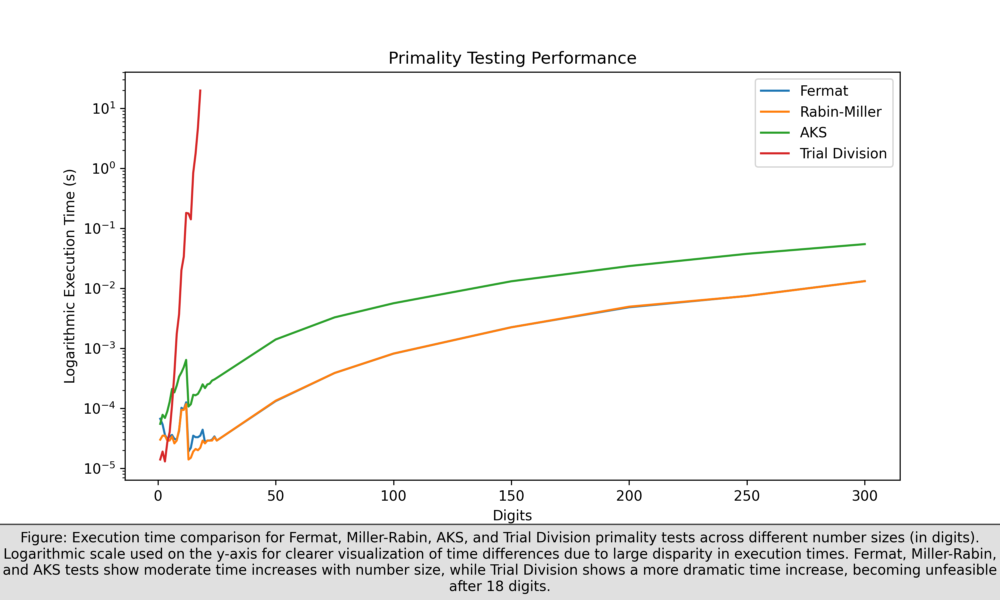

# Primality Testing Algorithms

This repository comprehensively implements four primality testing algorithms: _Fermat's Primality Test, Miller-Rabin Primality Test, Agrawal-Kayal-Saxena (AKS) Primality Test, and Trial Division_. These algorithms play a crucial role in computer science and mathematics, particularly in cryptography, where prime numbers are essential for generating and identifying cryptographic keys. Prime numbers have applications in number theory, quantum mechanics, and encryption algorithms.

The project caters to the educational needs of students studying primality testing in number theory or computer science and researchers interested in the theoretical aspects of prime numbers and primality testing. Developers needing to incorporate primality testing in their software applications can also find this repository valuable.

Each algorithm is implemented as a separate Python script that can be executed independently, providing flexibility in usage. The project also includes a data generator that creates test numbers of varying sizes, making it easier for those wishing to compare the performance of these different algorithms.

Furthermore, the repository features an in-depth analysis of the algorithms' performance and efficiency, presented through tabular data and graphical plots. This analysis is helpful for educators needing illustrative material for teaching, researchers conducting comparative studies, and developers making informed decisions about which primality test to use in their applications.

## Repository Structure

```zsh
├── data
│   └── primes.py
├── docs
│   ├── Exploring the Efficiency and Accuracy of Primality Testing Techniques.pdf
│   └── primality_testing_performance.png
├── src
│   ├── aks.py
│   ├── fermat.py
│   ├── miller_rabin.py
│   └── trial_division.py
└── main.py
```

## Overview of Algorithms

### **Trial Division**

Trial Division is a deterministic primality test that assesses a number's primality by dividing it by all integers up to its square root. A number is prime if none of these integers divide it evenly, i.e., without leaving a remainder. For example, determining whether 71 is prime is divided by integers up to $\sqrt{8} \approx (8.43)$. As none of these divisions yield a zero remainder, 71 is deemed prime.

### **Fermat's Primality Test**

Fermat's test, a probabilistic primality algorithm, utilizes Fermat's Little Theorem. The algorithm iterates $k$ times and randomly selects an integer $a$ between 2 and $p-1$ in each iteration. If for all iterations, the congruence $a^{p-1} \equiv 1 \pmod{p}$ holds, then $p$ is likely prime. Any violation of the congruence identifies $p$ as composite, with $a$ serving as Fermat's witness to compositeness. The time complexity of this algorithm is $O(k \hspace{0.25em} \log n)$, where $n$ is the candidate prime and $k$ is the number of test iterations.

### **Miller-Rabin Primality Test**

The Miller-Rabin test is a probabilistic primality algorithm with time complexity $O(k \hspace{0.25em} log^{3(n)})$, where $n$ is the candidate prime and $k$ the number of test iterations. Building upon Fermat's test and modulo congruences, it uses a system of congruences to establish "witnesses," values indicating compositeness. An odd prime lacks Miller-Rabin witnesses; thus, if $n$ possesses a witness, it is composite. This method is often favored, with 75% of numbers from 2 to $n-1$ acting as witnesses for odd composites.

### **Agrawal-Kayal-Saxena (AKS) Primality Test**

The AKS algorithm, a deterministic polynomial-time primality test, operates on the theorem stating that an integer $n > 2$ is prime if the polynomial congruence relation $(X + a)^ n = (X^n + a) \hspace{0.1cm} (mod \hspace{0.1cm} n)$ holds for some $a$ coprime to $n$.

The test first ensures $n \geq 1$, then checks if $n$ is a perfect power (thus non-prime). It then finds the smallest $r$ such that $n \bmod r$ exceeds the square root of $r$'s most significant prime factor. After setting these bounds, the test examines $n$'s greatest common divisor and checks if the polynomial congruence holds for integers $1$ to $\sqrt{r}+1$.

If satisfied, $n$ is prime. Its time complexity is $O(log^6 n)$. While noted for theoretical importance as the first deterministic primality test, AKS is not the most efficient, and probabilistic tests, like Miller-Rabin, can often prove superior.

## Performance Evaluation

The tabulated data in the following segment represents an empirical analysis of four major primality testing algorithms—Fermat's test, Miller-Rabin test, Agrawal-Kayal-Saxena (AKS) test, and Trial Division. We evaluated these algorithms based on their execution times (in seconds) against a range of input magnitudes, from 1 to 300 digits. This examination aims to determine the suitability of these algorithms for different ranges of numbers and their performance characteristics.

The results demonstrate a direct correlation between the digit length of the input and the execution time of the algorithms. This relationship is particularly noteworthy for larger input sizes. Among the tests, Fermat's and Miller-Rabin's exhibited similar computational complexities and demonstrated manageable increments in execution time, even when the input magnitude reached 300 digits. Their performance underlines their practicality for primality testing of extensive numeric inputs.

The AKS test exhibited a consistent increase in execution time as the numeric magnitude rose. However, the rate of this increase was more steep compared to Fermat's and Miller-Rabin's tests, notably for more significant digit numbers. Therefore, while AKS is suitable for smaller numeric magnitudes, it is less efficient for testing the primality of more significant numbers, which is critical to consider when selecting a primality testing algorithm.

On the other hand, the Trial Division algorithm manifested a significant increase in execution time for even moderately large numbers, becoming impractical for inputs above 18 digits. Beyond this point, the execution time rises drastically, rendering the algorithm unsuitable for larger magnitudes.

Based on this evaluation, Fermat's and Miller-Rabin's tests emerge as the most efficient algorithms for large-scale primality testing. Nevertheless, for smaller number magnitudes, the AKS test can provide more efficiency, and the Trial Division method might be more practical. These observations provide significant insights for users when selecting the appropriate primality testing algorithm based on the digit length of their inputs.



## Usage

To run the existing test cases, execute the `main.py` script from the command line. For example:

```shell
python3 main.py
```

To perform a primality test on a custom number, import the relevant test function from the corresponding Python script and call it with the number as an argument. For example:

```python
from src.fermat import fermat_test
from src.miller_rabin import miller_rabin_test
from src.aks import aks_test
from src.trial_division import trial_division_test

# Test number
n = 392995583789

# Fermat's test
print(f"Fermat's test: {fermat_test(n)}")

# Miller-Rabin test
print(f"Miller-Rabin test: {miller_rabin_test(n)}")

# AKS test
print(f"AKS test: {aks_test(n)}")

# Trial Division
print(f"Trial Division: {trial_division_test(n)}")
```
